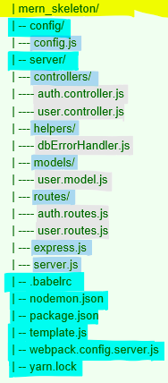

#MERN BACKEND

Steps to install the MERN backend:
1. set up project folder 
2. Install and configure necessary Node modules 
3. prepare run scripts 
4. implement an Express server
5. implement a user model with mongoose 
6. implement API endpoints with Express router
7. implement JWT-based authentication

#1. Folder and File Structure for MERN backend 
- this creates a functioning, stand alone server-side app:

- root directory: configuation files
- server folder: back-end code 
    - divide into: models, controllers, routes, helpers, common server-side code 

-* moved server.js into server folder for organization - this broke everything
    - make sure to update any files that reference server.js with updated paths: 
        - server-side: - package.json (main, dev, start)
                       - server.js (path for static files, catch-all route, assets-router)
        - client side: package.json (dev)
        - in vite.config.js I had to change the root from '.' to './client' or else the front-end would not work server side 
        *** now front end only works server side. if root is './' then front end only works client side
          - would need to use a conditional root path to solve this
          - after doing some research, I only need the front end to work server-side, as that is how a full-stack app usually works 

#2. Install and configure necessary Node modules 
2. Development dependencies
- confifure + install Vite and Nodemon if not done already
- check if they're installed globally:
vite --version
nodemon --version  
- check if they're installed locally:
npx nodemon --version
npx vite --version
- install vite globally so it can be used from anywhere
npm install -g vite
- install nodemon from client folder
  npm install nodemon --save-dev
-can run vite locally without a global installation:
npx vite --version

3. Configure Babel
1. create babel.rc file in root, add this code:
{
"presets": [
["@babel/preset-env", 
{
"targets": {
"node": "current" 
}
} 
]
]
}

4.. install Babel modules
yarn add --dev @babel/core babel-loader @babel/preset-env

5. Config variables 
- in config.js define some server-side configuration-related variables 
 const config = {
 env: process.env.NODE_ENV || 'development',
 port: process.env.PORT || 3000,
 jwtSecret: process.env.JWT_SECRET || "YOUR_secret_key", 
 mongoUri: process.env.MONGODB_URI ||
 process.env.MONGO_HOST ||
 'mongodb://' + (process.env.IP || 'localhost') + ':' + 
(process.env.MONGO_PORT || '27017') +
 '/mernproject'
 }
 export default config

#3 Run scripts
- yarn development script 
- confirm this script in package.json: "dev": "concurrently \"vite --config ./client/vite.config.js\" \"nodemon ./server/server.js\""
- add the type=module in the package.json in server side 
- *** change to import from require in server.js since using ES modules:
  import express from 'express';
  import path from 'path';
- *** had to add this to top of server.js file to use ES modules since __dirame is not available by default:
    import { fileURLToPath } from 'url';
    import { dirname } from 'path';
- ** update assets-router.js (see file comments)
- now run 
yarn dev 

#4 Implement an Express server
1. Configure express
- install the express module:
yarn add express
- import into express.js file, configure, make available to rest of app:
    import express from 'express’ 
    const app = express()
   /*... configure express ... */ 
   export default app
- add modules to handle HTTP requests and serve responses properly:
body-parser: yarn add body-parser 
cookie-parser: yarn add cookie-parser 
compression: yarn add compression 
helmet: yarn add helmet 
cors: yarn add cors 
- update express.js to import these modules and update express app before exporting it for use in the server (see file comments)
- express can now accept and process HTTP requests

2. Starting the server 
- update server.js to implement the server 
import config from './config/config.js'; to set the port #
app.use(express.static(path.join(__dirname, "../dist")));
- update the app.listen function that sets the port with the config 
**** this is where you would display a message in browser when running the server****

- added an.env file in root and defined port #
- the install dotenv to load environmemtal variables
 npm install dotenv

 - import dotenv in server.js:
import dotenv from 'dotenv';
dotenv.config();
port 5173 serves the front end using vite
port 5001 serves the front end using express 
- configure to read .env from root folder:
 dotenv.config({ path: path.resolve(__dirname, '../.env') }); 

#5 Implement a user and contact model and controllers with mongoose 
1. Setting up Mongoose 
yarn add mongoose
- update server.js to import the mongoose module. configure it so that it uses native ES6 promises, use it to handle the connection to the MongoDB database 
- Create a template.js file in the root
- update express.js to serve this file at the root
import Template from './../template.js'
...
app.get('/', (req, res) => {
res.status(200).send(Template()) 
})
...
- Run npm install mongodb
- add connection string (mongoURi)
    - add connection string as environmental variable and add .gitignore file with .env in it
- update server.js
import app from './server/express.js'
- throws new Error(`unable to connect to database: ${config.mongoUri}`) -*will continue with configuration of MongoDB database and troubleshoot after
- run the server:
cd client
yarn dev

2. Creating the user and contat models 
- create a model for both the user and contact collection in your database
  - define a schema for the type of data to be stored (name, data type, certain conditions/restrictions/business rules)

3. Create the controllers
- 

4. run: yarn add lodash - used when updating 
- run: Yarn add method-override

5. create route.js files for both contact and user to define the routes for handling all CRUD opertions for their API's (GET/POST/PUT/DELETE)
- syntax: router.route('url')l.get(controllername.methodname)
- example: router.route('api/contacts').get(contactCtrl.read)

6. update express.js by importing all route files 
- configure express to use body-parser as middleware (add below lines above configurations)
  app.use(express.json());
  app.use(express.urlencoded({ extended: true }));
- configure routes as well

